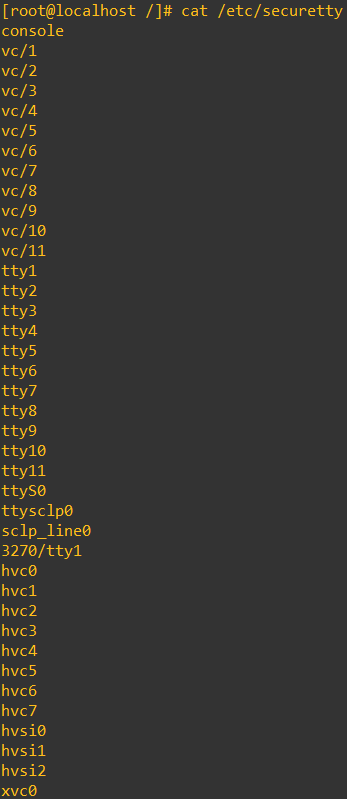
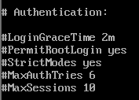

# 1. 계정관리 > 1.1 root 계정 원격접속 제한

## Why? - root 계정 원격접속 제한을 왜 해야 하는가?
서버를 운영하다가 보면 서버실에 들어가서 콘솔(Console)로 작업하는 것보다 사무실 책상에서 Telnet, SSH를 이용하여 원격 연결 후 작업하는 경우 대부분이다. 원격 로그인을 할 때 편의상 root 계정으로 바로 로그인을 허용하고 사용하는 경우가 많으며 이는 보안상 문제가 발생할 수 있다.  

그 이유는 공격자(해커 등)들은 기본적으로 먼저 서버에 Open 되어 있는 Port를 확인 후 Telnet나 SSH로 원격 접속이 가능한 경우 무작위 대입 공격(Brute Force Attack), 사전 대입 공격(Dictionary Attack)등을 이용하여 root 계정으로 로그인을 시도한다. 해당 공격들이 성공하면 서버는 공격자(해커 등)에 손에 넘어가고 그들의 놀이터가 된다. 

이를 방지 위해서는 원격 접속 시 root 계정 로그인을 제한하고 일반 계정으로 로그인 후 su를 이용해서 root로 상승해야 한다.

## Telnet vs SSH
Telnet : 가상 터미널 서비스를 위한 표준 TCP/IP 프로토콜    
SSH : Secure Shell은 네트워크를 통해 다른 컴퓨터에 로그인하여 원격 시스템에서 명령을 실행하는 프로그램이다.   
Telnet : 23 / SSH : 22

Telnet과 SSH의 가장 큰 차이는 보안이다.
SSH는 인터넷과 같은 보안되지 않는 네트워크에서도 네트워크를 통해 데이터의 암호화된 형태로 정보를 공유하고 전송한다.   
Telnet은 보안 매커니즘을 사용하지 않기 때문에 패킷을 확인해보면 평문으로 데이터를 전송되는 것을 확인할 수 있다.


## 내부망에 Telnet을 사용하는 이유?
이론적으로 어디에서든 SSH를 사용하면 된다.   
굳이 안전한 내부망이라고 Telnet을 사용할 이유가 없다고 생각한다.   
하지만 사용하는 이유는?   
기존에 Telnet을 사용하던 회사는 SSH로 변경하기가 귀찮기도 하고 거부감이 있기 때문이라고 생각한다.    
SSH를 사용하려면 따로 설정도 해야 하고,    
지금 Telnet 써도 아무 문제 없이 잘 운용하고 있는데 굳이 바꿔야 하나?   
혹시 바꿔서 문제가 생기면?   
라는 식의 보수적인 관점도 이유가 있을 것이라 생각한다.

## 어쩔 수 없이 사용하는 경우
외부에서 인터넷망을 거쳐 AWS로 접근해야 하는 경우에는 최소한 사내망을 거쳐 갈 수 있도록 보안조치를 취해야 한다


## pts/0 ~ pts/x 존재하면 안되는 이유
pts는 원격 사용자가 SSH, Telnet 같은 도구로 서버에 접속할 때 할당되는 가상 터미널(pseudoterminal slave)이다.        
원격 접속 세션은 물리적인 터미널 대신 pts를 사용하여 사용자와 시스템 간 통신을 처리한다.        
예를들어 ssh user@server 명령어로 서버에 접속하게 되면,         
서버는 해당 세션에 대해 pts/0, pts/1 등으로 가상 터미널을 할당하게 된다.

## pam.securetty.so 주석 제거해야 하는 이유
/etc/pam/login 파일에 있는 pam_securetty.so 구문은      
/etc/securetty 파일에 설정된 터미널에서만 root 로그인을 허용하는 기능이다.       
         
/etc/securetty 파일에는 위와 같은 내용들이 기본적으로 들어가 있는데,    
/etc/securetty 파일 내에 pts가 들어가있으면 pam.securetty.so 주석을 제거하여도      
할당된 pts(가상 터미널)이 자동적으로 root 로그인에 허용되기 때문에     
순서는 1. pts 구문 제거 -> 2. pam.securetty.so 주석 제거        
순서로 가야 한다.
 

### /etc/securetty 파일 설명
/etc/securetty 파일은 root가 로그인 가능한 터미널(tty)장치들을 나열해 둔 곳

**console**     
시스템의 기본 콘솔      
보통 물리적인 콘솔(컴퓨터에 직접 연결된 키보드와 모니터 등)을 의미

**vc/1 ~ vc/11**        
가상 콘솔(Virtual Console)을 의미       
물리적 콘솔에서 여러 가상 콘솔을 전환하며 사용할 수 있음              
Alt+F1 ~ Alt+F11 까지 전환 가능한 텍스트 모드의 콘솔        
이런 가상 콘솔은 물리적 키보드와 모니터를 통해 접근할 수 있음       

**tty1 ~ tty11**        
텍스트 기반의 가상 터미널 또는 가상 콘솔 (Teletyperwriter)      
tty1 ~ tty11 일반적으로 텍스트 모드에서 전환할 수 있는 가상 콘솔을 의미     
물리적인 키보드와 모니터를 통해 액세스할 수 있는 콘솔들     

**ttyS0**       
첫 번째 직렬 포트(secial port)      
하드웨어 장치인 직렬 포트를 의미.           
물리적인 직렬 인턴페이스를 통해 콘솔로 연결할 수 있는 장치.     
시스템이 원격 직렬 연결을 통해 관리되는 환경에서 사용됨

**ttysclp0**        
IBM 메인 프레임     

**sclp_line0**      
IBM 메인프레임      

**3270/tty1**       
IBM 메인프레임      

**hvc0 ~ hvc7**     
가상 콘솔(Hypervisor Virtual Console        
가상화 환경에서 하이퍼바이저에 의해 제공되는 콘솔을 의미        
리눅스가 가상 머신 환경에서 실행될 때 사용됨.       
하이퍼바이저와 가상 머신 간의 통신을 담당하는 가상 콘솔     

**hvsi0 ~ hvsi2**       
hvsi(Hypervisor Serial Interface). I        
하이퍼바이저에 의해 제공되는 직렬 인터페이스        
가상  머신과 하이퍼바이저 간의 통신을 위한 인터페이스로, 하이버바이저에 의해 가상화된 직렬 연결을 나타냄        

**xvc0**        
xvc(Xen Virtual Console).       
Xen 가상화 환경에서 제공되는 가상 콘솔      
Xen 하이퍼바이저를 통해 실행되는 가상 머신의 콘솔에 접근할 때 사용      

**pts와 차이점**        
pts는 가상 터미널의 일종으로 원격 세션을 통해 생성되고, 여러 사용자가 독립적으로 로그인할 수 있도록 하는 가상의 터미널.     
tty, vc, console 등은 물리적 또는 가상화된 터미널로, 주로 로컬 시스템에 직접 연결된 장치나 가상 콘솔을 의미


## “PermitRootLogin”이 포함된 항목을 검색하는 이유:
sshd config 파일의 PermitRootLogin은 ssh를 통해 root 로그인을 허용할 수 있는지를 제어하는 항목.
PermitRootLogin no 로 설정하게 되면, root 계정으로 원격 접속을 통한 직접 로그인이 불가능하게 된다.   
일반 계정으로 로그인하여 sudo 명령어로 일시적인 권한 사용을 유도할 수 있음


ppt, notepad, txt, 엑셀, gpt 참고
# 양호 취약 근거
## 양호
### telnet 비활성화
1. 원격 접속 프로토콜인 telnet이 비활성화 중이라 원격 접속을 제한하거나 사용중이지 않다고 판단하여 양호

### telnet 활성화
1. /etc/securetty   
root 사용자가 로그인할 수 있는 터미널을 제한하는 역할인 /etc/securetty 파일에 가상 터미널인 pts가 존재하지 않는 것은 root 계정으로의 원격 접속이 불가능하다 의미이기에 양호
2. /etc/pam.d/login    
/etc/pam/login 파일에 있는 pam_securetty.so 모듈은      
/etc/securetty 파일에 설정된 터미널에서만 root 로그인을 허용하는 기능이다. 즉 pam_securetty.so 모듈이 존재하고, /etc/securetty 파일 내에 pts 항목이 없다면 root 계정으로의 원격 접속이 불가능하다는 의미이므로 양호

### SSH 비활성화
1. 원격 접속 프로토콜인 SSH가 비활성화 중이라 원격 접속을 제한하거나 사용중이지 않다고 판단하여 양호

### SSH 활성화
1. sshd_config 파일 확인   
sshd config 파일의 PermitRootLogin은 ssh를 통해 root 로그인을 허용할 수 있는지를 제어하는 항목이다.   
PermitRootLogin no 로 설정하게 되면, root 계정으로 원격 접속을 통한 직접 로그인이 불가능하게 되므로 양호

## 취약
### telnet 활성화
1. /etc/securetty   
root 사용자가 로그인할 수 있는 터미널을 제한하는 역할인 /etc/securetty 파일에 가상 터미널인 pts가 존재하는 것은 root 계정으로의 원격 접속이 가능하다 의미이기에 취약
2. /etc/pam.d/login    
/etc/pam/login 파일에 있는 pam_securetty.so 모듈은      
/etc/securetty 파일에 설정된 터미널에서만 root 로그인을 허용하는 기능이다. 즉 pam_securetty.so 모듈이 존재하지 않고, /etc/securetty 파일 내에 pts 항목이 있다면 root 계정으로의 원격 접속이 가능하다는 의미이므로 취약

### SSH 활성화
1. sshd_config 파일 확인   
sshd config 파일의 PermitRootLogin은 ssh를 통해 root 로그인을 허용할 수 있는지를 제어하는 항목이다.   
PermitRootLogin no 설정이 없다면, root 계정으로 원격 접속을 통한 직접 로그인이 가능하게 되므로 취약


1. root 계정 원격접속 제한에서는 telnet 사용할 경우 조치방안에 대해서 말해주고 있는데
3.24 에는 telnet을 사용하면 취약이라고 하고 있음
애초에 사용하면 안되는 프로토콜에 대해서 왜 사용할 경우를 만들어두는지?
-> 
목적이 다르다.
1번 root 계정 원격접속 제한에 대해서는 원격접속을 제한해야 한다는 목적을 토대로 여러 원격접속 프로그램에 대해서 대처방안을 설명을 해주고 있는 것이고
3.24 ssh, telnet에 대해서는 안전한 프로토콜 사용을 목적을 가지고 있기 때문에 telnet과 ssh의 안전성을 보고 telnet을 사용하면 오류인 부분인다.

그리고 내부망에서 ssh를 사용하지 않고 telnet을 사용하는 경우에는 왜 그렇게 사용중인 건지?
->
실제로는 거의 없다. 다 ssh 사용
하지만 예를들어 각각 보안장비가 필요로 하는 프로토콜에 따라서 특정 프로토콜을 사용할 수밖에 없는 경우도 있을 수 있다.
극단적인 예로 Telnet만 지원하는 보안장비의 경우에는 Telnet을 사용할 수밖에 없다


---
---
---
### 1. 계정관리 > 1.1 root 계정 원격접속 제한
### 취약점 개요
**점검내용**  
시스템 정책에 root 계정의 원격터미널 접속차단 설정이 적용되어 있는지 점검

**점검목적**    
관리자 계정 탈취로 인한 시스템 장악을 방지하기 위해 외부 비인가자의 root 계정 접근 시도를 원천적으로 차단하기 위함

**보안위협**    
root 계정은 운영체제의 모든 기능을 설정 및 변경이 가능하여(프로세스, 커널변경 등) root 계정을 탈취하여 외부에서 원격을 이용한 시스템 장악 및 각종 공격으로(무작위 대입 공격) 인한 root 계정 사용 불가 위협

**참고**    
※ root 계정 :    
여러 사용자가 사용하는 컴퓨터에서 모든 기능을 관리할 수 있는 총괄권한을 가진 유일한 특별 계정. 유닉스 시스템의 루트(root)는 시스템 관리자인 운용 관리자(Super User)로서 윈도우의 Administrator 보다 높은 System 계정에 해당하며, 사용자 계정을 생성하거나 소프트웨어를 설치하고, 환경 및 설정을 변경하거나 시스템의 동작을 감시 및 제어할 수 있음

※ 무작위 대입 공격(Brute Force Attack) :    
특정한 암호를 풀기 위해 가능한 모든 값을 대입하는 공격 방법

※ 사전 대입 공격(Dictionary Attack) :   
사전에 있는 단어를 입력하여 암호를 알아내거나 암호를 해독하는 데 사용되는 컴퓨터 공격 방법
</br></br>

### 점검대상 및 판단기준
**대상**     
SOLARIS, LINUX, AIX, HP-UX 등

**판단기준**   
- 양호
    - 원격 터미널 서비스를 사용하지 않거나, 사용 시 root 직접 접속을 차단한 경우
- 취약
    - 원격 터미널 서비스 사용 시 root 직접 접속을 허용한 경우

**조치방법**   
원격 접속 시 root 계정으로 바로 접속 할 수 없도록 설정파일 수정

## 점검 및 조치사례
### OS별 점검 파일 위치 및 점검 방법

**LINUX**   
[Telnet]   
\# cat /etc/pam.d/login   
auth required /lib/security/pam_securetty.so     


\# cat /etc/securetty   
pts/0 ~ pts/x 관련 설정이 존재하지 않음   


[SSH]   
\# cat /etc/ssh/sshd_config   
PermitRootLogin no   


## 해결방안   
[Telnet 서비스 이용 시]    
```
vi /etc/pam.d/login  
```


[SSH 서비스 이용 시]   
```
PermitRootLogin Yes
->
PermitRootLogin No
```

