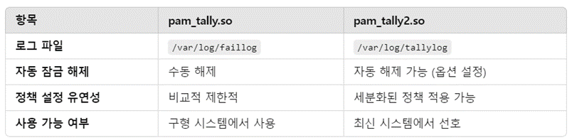

# 1. 계정관리 > 1.3 계정 잠금 임계값 설정
## Why? - 계정 잠금 임계값 설정을 왜 해야 하는가?
계정 잠금 임계값 설정이 없다면 계정탈취 목적의 공격자들은 로그인에 성공할 때까지 무작위 대입 공격, 사전 대입 공격, 추측 공격 등 로그인에 성공할 때까지 무한정 보낼 수 있다. 이러한 무작위 공격이 계속 된다면 시스템 자원이 불필요하게 소모되어 비정상적인 트래픽이 증가하고 시스템의 가용성이 떨어져 동작중인 서비스에 문제가 생길 수 있다

## 내 기준 - 임계값 정도
내부정책을 확인하여 임계값 정도를 확인하고, 없다면 주통기를 기준으로 10회로 설정한다.    
주통기 기준 10회로 설정하지만, 초과되는 경우 너무 큰 경우를 제외하고     
정확한 기준에 대해서는 고객사 보안담당자와 소통을 하여 임계값 정도를 맞춘다.   
### 취약점 진단 컨설턴트는 취약점을 찾아주는 역할이지, 기준을 정해주는 역할은 아니다

## 임계값을 초과 후 잠금해제의 경우
임계값을 초과하여 계정잠금이 된 경우 당사자 본인이 임의로 해제할 수 있는 방법을 제공하지 않고,    
관리자가 초기화해주지 않으면 사용하지 못하게 한다.

## pam 모듈
pam 모듈에서 임계값 설정을 해준다면 root 권한 상승(sudo), 리눅스 OS 로그인 등 여러 부분에서 계정잠금 임계값 설정을 해줄 수 있다.

## “pam_tally.so” 
pam_tally.so 모듈은 사용자가 로그인을 시도할 때마다 실패한 시도 횟수를 기록하고, 임계값을 넘어서면 계정을 잠그는 기능을 제공한다.

이 기능은 패스워드 일정 횟수 입력했는데도 로그인 실패 시, 해당 계정을 일정시간 혹은 영구히 잠궈, 이후 제대로 된 패스워드 입력해도 로그인 할 수 없도록 만드는 설정이다.

## pam_tally.so 와 pam_tally2.so 차이
 

## system-auth 와 common-auth 차이점
system-auth는 일반적으로 Debian 계열 리눅스 시스템에서 사용하는 이름이다.    
common-auth는 일반적으로 RedHat 계열 리눅스 시스템에서 사용하는 이름이다.

## "deny=" 와 "retry=" 차이
"deny="    
deny 뒤에 오는 숫자만큼 패스워드 틀리면 <U>계정 잠금이 되어, 다시 세션 접속을 해도 암호 입력 시도가 불가능</U>하지만,

"retry="   
retry 뒤에 오는 숫자만큼 패스워드 틀리면 해당 세션에서 암호 입력이 중단되지만,   
<U>세션을 종료하고 다시 로그인하면 다시 암호 입력 시도가 가능</U>하다.

3. 계정잠금 임계값 10회 이상인 경우에는 어떻게 하는지
->
계정잠금 임계값의 기준은 개개인 기준이 다르지만 결과적으로는
고객사 보안담당자와 소통을 하여 임계값 정도를 맞춰가면 된다.
취진 컨설턴트는 취약점을 찾아주는 역할이지 기준을 정해주는 역할은 아니다.

?예를들어 임계값 설정을 왜 해야하냐고 고객사에서 물어본다면
주통기에 있는 보안 위협에 대해서 설명을 해주시는지
-> 그렇다 기본적으로 주통기 보안 위협에 대해서 설명을 해주면서 설득을 시키지만
그럼에도 설명이 부족한 경우에는 해당 위협에 대응되는 사례를 가져와서 설명해주는 경우가 많다